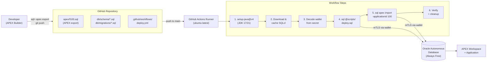

# Oracle APEX CI/CD with GitHub Actions — Customer Demo Research Report

> **Goal:** A complete, citable blueprint for a 15-minute customer demo showing how GitHub Actions deploys and updates an Oracle APEX application end-to-end.

---

## Executive Summary

Oracle APEX applications can be cleanly deployed with **GitHub Actions** using a small, well-defined toolchain: **SQLcl** (Oracle's official command-line client) exports an APEX app to a versionable `.sql` file (or split directory) which is committed to Git[^1]. A GitHub Actions workflow then installs Java + SQLcl on an `ubuntu-latest` runner, decodes an Oracle Autonomous Database (ADB) wallet from a base64 GitHub Secret, applies schema changes, and runs `apex import` to update the application[^2][^3]. The most aligned public reference for this exact pattern is **`sachinjain47/apex-sales-dashboard`** which contains a working ~110-line `deploy.yml`[^4]. Critically, **`oracle-actions/run-sql`, `oracle-actions/configure-db-wallet`, and `oracle-actions/setup-sqlcl` do NOT exist** — Oracle has not published an APEX-specific Action; SQLcl is downloaded directly from `download.oracle.com` either inline or via the small community Action **`cpruvost/setup-sqlcl@v1.0.0`**[^5][^6]. The recommended target environment is **Oracle Autonomous Database Always Free** (APEX pre-installed, wallet-based mTLS reachable from GitHub-hosted runners)[^7].

---

## Architecture (Demo Pipeline)



**Trigger model:** push to `main` (or PR merge) on paths `apex/**`, `db/**`, `scripts/**`. Optional `workflow_dispatch` for manual seed-data load[^4].

---

## Key Repositories & Resources

| Repo / Resource | Purpose | Status |
|---|---|---|
| [`sachinjain47/apex-sales-dashboard`](https://github.com/sachinjain47/apex-sales-dashboard) | **Best end-to-end working reference** — complete `deploy.yml`, SQLcl + wallet flow, schema DDL, seed data | Active (2026-05)[^4] |
| [`oracle-actions`](https://github.com/oracle-actions) (org) | Official Oracle GitHub Actions: `setup-java`, `run-oci-cli-command`, `login-ocir` — **no SQLcl/APEX action**[^6] | Active |
| [`cpruvost/setup-sqlcl`](https://github.com/cpruvost/setup-sqlcl) | Community Action that `wget`s `sqlcl-latest.zip` from `download.oracle.com`; thin wrapper, Linux-only[^5] | Maintained, low adoption (1★) |
| [`United-Codes/uc-local-apex-dev`](https://github.com/United-Codes/uc-local-apex-dev) | Docker Compose stack of Oracle 26ai + ORDS + APEX with a CI workflow that tests the full stack | Active (2026-05)[^8] |
| [`MaikMichel/dbFlow`](https://github.com/MaikMichel/dbFlow) | Battle-tested APEX/DB deployment framework (Git-flow, diff-based builds). Invoked **from** a CI workflow | Active (2025-12)[^9] |
| [`jkvetina/ADT`](https://github.com/jkvetina/ADT) | Python-based APEX Deployment Tool — handles app + static files + workspace files since 2008 | Active[^10] |
| [`oracle-samples/apex-sert`](https://github.com/oracle-samples/apex-sert) | Production reference: SQLcl + Liquibase + APEX (`lb generate-apex-object`); split-export directory pattern | Active[^11] |
| [`ORAsonjameyer/DiY_articles`](https://github.com/ORAsonjameyer/DiY_articles) | Oracle employee Sonja Meyer's SQLcl Projects walkthrough (2025) — most current "official-flavored" tutorial | Active[^12] |
| [`oracle-devrel/technology-engineering`](https://github.com/oracle-devrel/technology-engineering) | Oracle EMEA PreSales DevOps for Oracle Database best-practices guide | Active[^13] |
| Oracle LiveLab **WID=3000** | "CI/CD for Database" — official hands-on Git + Liquibase + SQLcl lab | Live[^14] |

> **Confirmed NOT existing:** `oracle-actions/run-sql`, `oracle-actions/configure-db-wallet`, `oracle-actions/setup-sqlcl`, `oracle-samples/apex-cicd`[^6][^5].

---

## Recommended Demo Recipe ("Quick & Easy" — 15 min on stage)

### Components

| Layer | Choice | Why |
|---|---|---|
| **Database** | Oracle Autonomous DB **Always Free** (Transaction Processing / ATP) | APEX pre-installed; free; wallet-based mTLS reachable from GitHub-hosted runners[^7] |
| **CI engine** | GitHub Actions, `ubuntu-latest` | Native to GitHub, free for public repos |
| **Java** | `actions/setup-java@v4` (Temurin 17) — or `oracle-actions/setup-java@v1` (Oracle JDK 21)[^15] | SQLcl requires JDK 11+ |
| **SQLcl install** | Inline `curl` + `unzip` (most flexible) OR `cpruvost/setup-sqlcl@v1.0.0` (one line, no version pin)[^5] | Recommended: inline curl with `actions/cache` for caching |
| **Schema migration** | Plain numbered SQL scripts (`db/schema/`, `db/migrations/`) for clarity in the demo. Upgrade path to **SQLcl Liquibase** (`lb update`) when production-ready[^13] | Plain SQL is more demo-friendly; Liquibase adds idempotency for production |
| **APEX deployment** | `sql> apex export -applicationid 100` (dev side) + `sql> apex import -applicationid 100 -workspacename DEMO -file apex/f100.sql` (CI side)[^1][^16] | Built into SQLcl; no extra tooling |
| **Sample app** | Custom "Customer Feedback" mini-app: 1 table, 1 form page, 1 interactive report | Audience grasps domain instantly; one column-add becomes a visible "demo moment" |

### Recommended Repo Structure

```
apex-cicd-demo/
├── .github/
│   └── workflows/
│       └── deploy.yml              # The main GitHub Actions pipeline
├── apex/
│   └── f100.sql                    # SQLcl: apex export -applicationid 100
├── db/
│   ├── install.sql                 # Master installer (@@schema/*, @@migrations/*)
│   ├── schema/
│   │   └── 001_create_feedback.sql # Initial DDL
│   ├── migrations/
│   │   └── 002_add_category.sql    # The "demo moment" — change to add live
│   └── seed_data.sql               # 10 rows of sample data
├── scripts/
│   └── deploy.sql                  # SQLcl master: runs db/install.sql
├── .gitignore                      # wallet/, sqlcl/, *.wallet, *.p12, *.sso
└── README.md
```

Based directly on `sachinjain47/apex-sales-dashboard` layout[^4] and SQLcl split-export conventions in `oracle-samples/apex-sert`[^17].

---

## Complete Working `deploy.yml` (adapted from `sachinjain47/apex-sales-dashboard`)

```yaml
# .github/workflows/deploy.yml
name: Deploy APEX App to OCI ADB

on:
  push:
    branches: [main]
    paths: ['db/**', 'apex/**', 'scripts/**']
  workflow_dispatch:
    inputs:
      seed_data:
        description: 'Load seed data? (first deploy only)'
        required: false
        default: 'false'
        type: choice
        options: ['false', 'true']

jobs:
  deploy:
    runs-on: ubuntu-latest
    environment: production
    steps:
      - uses: actions/checkout@v4

      - name: Set up Java 17        # SQLcl requires JDK 11+
        uses: actions/setup-java@v4
        with:
          distribution: temurin
          java-version: '17'

      - name: Cache SQLcl
        id: cache-sqlcl
        uses: actions/cache@v4
        with:
          path: sqlcl
          key: sqlcl-${{ runner.os }}-latest

      - name: Download SQLcl
        if: steps.cache-sqlcl.outputs.cache-hit != 'true'
        run: |
          curl -fsSL -o sqlcl.zip \
            "https://download.oracle.com/otn_software/java/sqldeveloper/sqlcl-latest.zip"
          unzip -q sqlcl.zip && rm sqlcl.zip
          chmod +x sqlcl/bin/sql

      - name: Extract OCI Wallet
        run: |
          mkdir -p wallet
          echo "${{ secrets.OCI_WALLET_B64 }}" | base64 --decode > wallet/wallet.zip
          unzip -q wallet/wallet.zip -d wallet/ && rm wallet/wallet.zip
          chmod 600 wallet/*    # Oracle rejects world-readable wallets
          echo "TNS_ADMIN=${{ github.workspace }}/wallet" >> "$GITHUB_ENV"

      - name: Deploy DB Schema
        env:
          DB_USER: ${{ secrets.OCI_DB_USERNAME }}
          DB_PASS: ${{ secrets.OCI_DB_PASSWORD }}
          DB_SVC:  ${{ secrets.OCI_DB_SERVICE }}
        run: |
          sqlcl/bin/sql -s "${DB_USER}/${DB_PASS}@${DB_SVC}" @scripts/deploy.sql

      - name: Load Seed Data
        if: github.event_name == 'workflow_dispatch' && github.event.inputs.seed_data == 'true'
        env:
          DB_USER: ${{ secrets.OCI_DB_USERNAME }}
          DB_PASS: ${{ secrets.OCI_DB_PASSWORD }}
          DB_SVC:  ${{ secrets.OCI_DB_SERVICE }}
        run: |
          sqlcl/bin/sql -s "${DB_USER}/${DB_PASS}@${DB_SVC}" @db/seed_data.sql

      - name: Import APEX Application
        env:
          DB_USER: ${{ secrets.OCI_DB_USERNAME }}
          DB_PASS: ${{ secrets.OCI_DB_PASSWORD }}
          DB_SVC:  ${{ secrets.OCI_DB_SERVICE }}
        run: |
          sqlcl/bin/sql -s "${DB_USER}/${DB_PASS}@${DB_SVC}" << 'EOF'
          apex import -applicationid 100 -workspacename DEMO -file apex/f100.sql
          EXIT 0
          EOF

      - name: Verify Deployment
        env:
          DB_USER: ${{ secrets.OCI_DB_USERNAME }}
          DB_PASS: ${{ secrets.OCI_DB_PASSWORD }}
          DB_SVC:  ${{ secrets.OCI_DB_SERVICE }}
        run: |
          sqlcl/bin/sql -s "${DB_USER}/${DB_PASS}@${DB_SVC}" << 'EOF'
          SELECT object_name, object_type, status
          FROM   user_objects
          WHERE  object_name LIKE 'CF_%'
          ORDER  BY object_type, object_name;
          EXIT 0
          EOF

      - name: Cleanup Wallet
        if: always()
        run: rm -rf wallet/
```

Verbatim core pattern from `sachinjain47/apex-sales-dashboard:.github/workflows/deploy.yml:1-110`[^4], with `chmod 600` added as required by Oracle's TLS layer[^2].

---

## Supporting SQL Files

### `db/schema/001_create_feedback.sql`

```sql
CREATE TABLE cf_feedback (
    id         NUMBER GENERATED ALWAYS AS IDENTITY PRIMARY KEY,
    name       VARCHAR2(100) NOT NULL,
    email      VARCHAR2(150),
    rating     NUMBER(1) NOT NULL CHECK (rating BETWEEN 1 AND 5),
    comment    VARCHAR2(4000),
    created_at DATE DEFAULT SYSDATE NOT NULL
);

CREATE INDEX cf_feedback_rating_idx  ON cf_feedback (rating);
CREATE INDEX cf_feedback_created_idx ON cf_feedback (created_at);
```

### `db/migrations/002_add_category.sql`  ← *the live "demo moment"*

```sql
ALTER TABLE cf_feedback
    ADD category VARCHAR2(50) DEFAULT 'General'
        CONSTRAINT cf_feedback_cat_chk
        CHECK (category IN ('General','Product','Support','Billing','Other'));

COMMENT ON COLUMN cf_feedback.category IS 'Feedback category added v1.1';
COMMIT;
```

### `scripts/deploy.sql` (SQLcl master)

```sql
SET FEEDBACK ON
SET ECHO ON
SET SERVEROUTPUT ON SIZE UNLIMITED
WHENEVER SQLERROR EXIT SQL.SQLCODE ROLLBACK   -- critical for CI: fail loud, not silent[^18]

PROMPT [1/2] Installing DB schema...
@@../db/install.sql

PROMPT [2/2] Running pending migrations...
@@../db/migrations/002_add_category.sql

PROMPT Done.
EXIT 0
```

### `.gitignore` (security-critical)

```gitignore
# Wallet files — NEVER commit
wallet/
*.wallet
*.p12
*.sso
*.jks
cwallet.sso
ewallet.p12

# SQLcl binary
sqlcl/
sqlcl.zip
```

---

## Customer Setup Steps (one-time, ~20 min)

### 1. Provision Oracle Autonomous DB (Always Free)
- `cloud.oracle.com` → **Autonomous Database** → **Create Autonomous Database**
- Workload: **Transaction Processing** (ATP — includes APEX)
- ✓ Always Free, set ADMIN password
- After creation: **Tools** tab → **Oracle APEX** → open Administration Services → **Create Workspace** named `DEMO` (new schema `DEMO_SCHEMA`)[^7][^16]

### 2. Build a small APEX app in the `DEMO` workspace
- App Builder → Create from table `CF_FEEDBACK` → Wizard gives you Home (interactive report) + Form
- App ID **must be `100`** to match the demo (or change `-applicationid` in YAML)

### 3. Export the app and commit
```bash
sql ADMIN/yourpass@yourdb_high
SQL> apex export -applicationid 100 -dir ./apex
git add apex/f100.sql && git commit -m "initial app export" && git push
```
Authoritative export commands from APEX 24.2 Admin Guide[^1].

### 4. Encode the wallet for GitHub Secrets
- OCI Console → ADB → **DB Connection** → **Download Wallet** (set wallet password)
- Encode:
  ```bash
  # Linux/macOS — IMPORTANT: -w 0 prevents line wrapping
  base64 -w 0 Wallet_yourdb.zip
  # Windows PowerShell
  [Convert]::ToBase64String([IO.File]::ReadAllBytes('.\Wallet_yourdb.zip'))
  ```

### 5. Configure GitHub Secrets

| Secret | Value | Where it comes from |
|---|---|---|
| `OCI_DB_USERNAME` | e.g. `ADMIN` | ADB admin user (or a dedicated `APEX_DEPLOY` schema user) |
| `OCI_DB_PASSWORD` | password | The ADMIN password you set |
| `OCI_DB_SERVICE` | e.g. `yourdb_high` | TNS alias inside `tnsnames.ora` of the wallet zip |
| `OCI_WALLET_B64` | base64 string | Output of step 4 |

Settings → Secrets and variables → Actions → New repository secret[^4].

### 6. Push a change → watch the demo run
```bash
echo "ALTER TABLE cf_feedback ADD priority VARCHAR2(10) DEFAULT 'Normal';" \
  >> db/migrations/002_add_category.sql
git commit -am "feat: add priority" && git push
```
GitHub → **Actions** tab → workflow runs (~90 s) → new column visible in APEX page.

---

## Technical Deep-Dive

### A. SQLcl `apex export` / `apex import` (Modern Standard)

The legacy Java `APEXExport` utility is **desupported as of APEX 24.2**[^1]. The current canonical tool is **SQLcl's built-in `apex` command**:

```text
SQL> apex list                                   # list apps in workspace
SQL> apex export -applicationid 100              # single-file: f100.sql
SQL> apex export -applicationid 100 -split       # split: ./f100/ directory tree
SQL> apex export -applicationid 100 -split -skipExportDate -expOriginalIds -dir ./apex
SQL> apex list -applicationid 100 -changesSince 2025-01-22   # partial export
SQL> apex import -applicationid 100 -workspacename DEMO -file apex/f100.sql
```

A split export produces a Git-friendly tree where each page, LOV, plugin, and template is its own `.sql` file[^17][^19]:

```
apex/f100/
├── install.sql                          # @@ all sub-files in order
├── application/
│   ├── create_application.sql
│   ├── set_environment.sql              # wwv_flow_imp.import_begin(...)
│   ├── pages/
│   │   ├── page_00000.sql               # Global page
│   │   ├── page_00001.sql, page_00002.sql, ...
│   └── shared_components/
│       ├── navigation/{lists,breadcrumbs,tabs}/
│       ├── user_interface/{lovs,templates,themes.sql}
│       ├── logic/{application_items,processes}/
│       ├── security/{authorizations,authentications}/
│       ├── plugins/{dynamic_action,template_component}/
│       └── files/                       # static files embedded as BLOBs
```

**For a 15-min demo prefer the single-file export (`f100.sql`)** — easier to show in Git diffs and one file to commit. Move to `-split` when teams scale.

### B. Workspace / App-ID Reconciliation on Import

APEX exports embed the source workspace ID, app ID, and ID offset. The import package `apex_application_install` overrides these at install time[^16]:

```sql
begin
    apex_application_install.set_workspace('DEMO');
    apex_application_install.set_application_id(100);
    apex_application_install.generate_offset();       -- REQUIRED if ID differs from export
    apex_application_install.set_schema('DEMO_SCHEMA');
    apex_application_install.set_application_alias('feedback');
end;
/
@apex/f100.sql
```

For a demo, **pin the same app ID (100) across all environments** so you can skip `generate_offset()` — simpler narrative. `sql> apex import ... -workspacename DEMO` (SQLcl 22.x+) wraps this in one command[^16].

### C. Authentication: ADB Wallet via mTLS

GitHub-hosted runners reach Autonomous Database over **public mTLS endpoints** using the wallet zip[^2][^7]:

1. Download wallet from OCI Console (contains `cwallet.sso`, `ewallet.p12`, `sqlnet.ora`, `tnsnames.ora`, `keystore.jks`, `truststore.jks`).
2. `base64 -w 0` the zip → store as GitHub Secret `OCI_WALLET_B64`.
3. In workflow: decode → unzip → `chmod 600 wallet/*` (Oracle rejects world-readable files) → `export TNS_ADMIN=$PWD/wallet`.
4. Connect: `sql USER/PASS@yourdb_high` — SQLcl uses thin JDBC; **no Oracle Client needed**[^2].

The wallet's `tnsnames.ora` defines three service aliases: `yourdb_high`, `yourdb_medium`, `yourdb_low` (different consumer groups / priorities).

### D. SQLcl Install Options Compared

| Approach | Pros | Cons |
|---|---|---|
| **Inline `curl` + `unzip`**  (recommended)[^4] | Full control; cacheable; pin via URL; works in any runner | ~5 lines of YAML |
| **`cpruvost/setup-sqlcl@v1.0.0`**[^5] | One-liner | Linux only; no version pin (always latest); no caching; uses deprecated `node12` runtime |
| **Manual download in shell step** (Oracle docs)[^2] | Same as inline curl, no Action dependency | Identical to inline curl |

Verdict: **Inline `curl` is the most production-friendly**. The `cpruvost` action is fine for a quick demo if simplicity matters more than control.

### E. SQLcl Error Handling — Don't Get a False Green Pipeline

SQLcl's default is to **continue on SQL errors** and exit 0. Every CI script must start with[^18]:

```sql
WHENEVER SQLERROR EXIT SQL.SQLCODE ROLLBACK
WHENEVER OSERROR  EXIT 9 ROLLBACK
SET FEEDBACK ON
SET ECHO ON
```

Without these, you'll have green-but-broken deployments. Note that DDL (`CREATE TABLE`, `ALTER TABLE`) auto-commits in Oracle — `ROLLBACK` only protects uncommitted DML; for DDL rollback you need Liquibase's `lb rollback -tag` mechanism[^11].

### F. The `oracle-actions` GitHub Org — What's Actually There

Exhaustive enumeration of `github.com/oracle-actions`[^6]:

| Action | Purpose | APEX Relevance |
|---|---|---|
| `oracle-actions/setup-java` (78★) | Install Oracle JDK | ✅ Required prerequisite for SQLcl |
| `oracle-actions/run-oci-cli-command` (37★) | Run any `oci` CLI command | ✅ Useful for ADB lifecycle, OCI Vault secrets |
| `oracle-actions/configure-kubectl-oke` | OKE | ❌ Irrelevant |
| `oracle-actions/login-ocir`, `get-ocir-repository` | OCIR | ❌ Container registry |
| `oracle-actions/setup-testpilot` | (Private/no docs) | ❓ |

**There is no `oracle-actions/run-sql`, `setup-sqlcl`, `configure-db-wallet`, or `apex-*` action.** Confirmed via GitHub API 404s[^6].

---

## Best-Practice Principles

1. **APEX export is the source of truth — the developer commits the export before merging**[^12]. CI deploys what's in Git; it does not re-export from a DEV workspace. (Optional advanced pattern: CI auto-export back to a branch, but adds complexity.)
2. **Schema migrations and APEX app changes ride in the same commit/PR**[^13]. They are coupled — a new column needs to exist before APEX pages referencing it can compile.
3. **Run schema migrations BEFORE `apex import`**[^13]. Order matters: missing tables/columns will cause confusing import-time errors.
4. **Use SQLcl's built-in Liquibase** (not standalone Liquibase) when you graduate to Liquibase — Oracle has extended it with APEX/EBR/extended-types support[^13]: `sql> lb update -changelog-file controller.xml`.
5. **Pin APEX application IDs across environments** for a demo (DEV/TEST/PROD all use app ID 100). Use `generate_offset()` only when you must change IDs[^16].
6. **Always use `WHENEVER SQLERROR EXIT` in CI scripts**[^18] — otherwise SQLcl silently swallows errors.
7. **`chmod 600 wallet/*` is mandatory**[^2] — Oracle's TLS layer refuses world-readable wallet files.
8. **Clean up the wallet on `if: always()`**[^4] — defense in depth even though the runner is ephemeral.
9. **Use GitHub Environments + required reviewers for PROD**[^4] — `environment: production` in the job gates manual approval.

---

## Minimum Viable Demo vs. Production-Grade Pipeline

| Layer | MVD (15 min demo) | Production-grade |
|---|---|---|
| Sample app | Custom 1-table mini-app, app ID 100 | Real customer app(s), per-env app IDs reserved |
| Branching | `main` only | `feature/*` → `main` (TEST) → release tag (PROD) |
| Env gates | None | GitHub Environments + required reviewers + protection rules |
| Migrations | Numbered plain SQL files | SQLcl Liquibase (`lb update` with controller.xml)[^13][^11] |
| Export | Manual `apex export` by dev, single file `f100.sql` | SQLcl Projects (`project export` / `project deploy`)[^12] or `lb generate-apex-object` -split[^11] |
| Static files / plugins | Embedded in app export | Separate jobs or `jkvetina/ADT live_upload.py`[^10] |
| Workspace-level objects | Created once manually | Liquibase changesets in `_dba/`[^11] |
| Testing | "Verify objects" SELECT | utPLSQL tests + Cypress E2E |
| Test DB | The same ADB instance | ADB clone per PR via Terraform / OCI CLI[^13] |
| Drift detection | None | `lb diff` between envs[^13] |
| Security scan | None | `oracle-samples/apex-sert` SERT in pipeline[^11] |
| Rollback | Manual | `lb rollback -tag` per tagged release[^13] |

---

## Learning Path (post-demo)

| Resource | URL / Reference | What it adds |
|---|---|---|
| **This demo** | Your repo | 15 min — concept proof |
| Oracle LiveLab **WID=3000** "CI/CD for Database" | `apexapps.oracle.com/pls/apex/r/dbpm/livelabs/view-workshop?wid=3000`[^14] | 2 hr — Liquibase + Git + SQLcl deep-dive |
| Sonja Meyer (Oracle) — "DiY DevOps with SQLcl Projects" | [`ORAsonjameyer/DiY_articles`](https://github.com/ORAsonjameyer/DiY_articles)[^12] | Modern SQLcl Projects (`project export`/`deploy`) walkthrough (2025) |
| Oracle DevRel — "DevOps for Oracle Database" | [`oracle-devrel/technology-engineering/.../git/files/git.md`](https://github.com/oracle-devrel/technology-engineering)[^13] | Reference architecture incl. ADB clone CI pattern |
| `MaikMichel/dbFlow` | https://github.com/MaikMichel/dbFlow[^9] | Adopting a full framework when your demo grows up |
| `oracle-samples/apex-sert` | https://github.com/oracle-samples/apex-sert[^11] | Production reference: SQLcl + Liquibase + APEX split exports |

---

## Caveats & Pitfalls

| # | Pitfall | Mitigation |
|---|---|---|
| 1 | `base64` without `-w 0` line-wraps the wallet → decode fails | Use `base64 -w 0 Wallet.zip` on Linux/macOS or PowerShell's `[Convert]::ToBase64String` on Windows[^7] |
| 2 | Wallet files world-readable → TLS handshake fails | `chmod 600 wallet/*` after extracting[^2] |
| 3 | SQLcl exits 0 on SQL errors → false green pipeline | First line of every CI SQL script: `WHENEVER SQLERROR EXIT SQL.SQLCODE ROLLBACK`[^18] |
| 4 | App ID mismatch between source export and target workspace | Either keep IDs identical, or call `apex_application_install.generate_offset()` before install[^16] |
| 5 | Wallet zip committed to Git | `.gitignore` must exclude `wallet/`, `*.wallet`, `*.p12`, `*.sso`, `cwallet.sso`, `ewallet.p12`[^16] |
| 6 | `cpruvost/setup-sqlcl` cannot pin SQLcl version (always latest) | Use inline `curl` to download a pinned SQLcl release URL when stability matters[^5] |
| 7 | SQLcl re-downloads 100 MB on every run | Wrap install in `actions/cache@v4` keyed on the SQLcl version[^4] |
| 8 | `apex.oracle.com` free workspace **cannot be a CI target** | It exposes no DB endpoint; CI cannot connect. Use ADB Always Free instead[^7] |
| 9 | Hardcoded credentials in YAML (some example repos do this) | Always use `secrets.*` references; treat `ChkBuk/wilmafin` as anti-example, not template[^20] |
| 10 | DDL auto-commits → no real transactional rollback | Use Liquibase rollback tags for production; for demo, accept this limitation |
| 11 | `oracle-actions/run-sql` / `configure-db-wallet` doesn't exist (some tutorials reference them) | Use manual SQLcl + base64 wallet steps[^6][^5] |

---

## Confidence Assessment

| Topic | Confidence | Notes |
|---|---|---|
| SQLcl `apex export`/`import` commands | **High** | Verified against Oracle APEX 24.2 Admin Guide[^1][^16] and live repos[^17][^19] |
| `sachinjain47/apex-sales-dashboard` workflow content | **High** | YAML quoted verbatim from the repo[^4] |
| `oracle-actions` org contents (what exists / doesn't) | **High** | Enumerated live via GitHub API[^6] |
| `cpruvost/setup-sqlcl` internals (action.yml, source code) | **High** | All files quoted verbatim with SHAs[^5] |
| ADB Always Free + wallet auth flow | **High** | Cross-confirmed across multiple repos[^4][^7][^20] |
| The "Customer Feedback" mini-app schema | **Medium (recommendation)** | Sized for a 15-min demo; you can adapt the schema/app ID freely |
| Oracle LiveLab WID=3000 content | **Medium** | Page metadata confirmed; full lab not walked end-to-end |
| Oracle LiveLab WID=3692 (suspected "APEX CI/CD") | **Low** | Network access blocked during research; recommend searching `livelabs.oracle.com` for "APEX CI/CD" directly |
| Philipp Hartenfeller / Adrian Png CI/CD blog URLs | **Low** | Domains unreachable during research; their `uc-local-apex-dev` repo[^8] confirms the local-dev side of their work |
| SQLcl Projects (`project export`/`deploy`) maturity for demo use | **Medium** | New in SQLcl 24.4+; well-documented by Sonja Meyer[^12] but community examples scarce. Safer to use plain `apex export`/`import` for a customer demo today |

### Assumptions made
- The customer demo target environment is OCI / Autonomous Database (overwhelmingly the simplest free option). If they require on-prem Oracle DB Free in a container, they would need a self-hosted runner (covered briefly in the `United-Codes` example[^8]).
- A live demo is wanted; if a recorded demo is acceptable, the same workflow applies but you can pre-stage the APEX app.
- The customer has an Oracle Cloud account or is willing to create a free one (5-min signup).

---

## Footnotes

[^1]: APEX export with SQLcl — official command syntax: [Oracle APEX 24.2 Admin Guide, §3.12.11.1.6 "Exporting One or More Applications"](https://docs.oracle.com/en/database/oracle/apex/24.2/aeadm/exporting-one-or-more-applications.html). Note: the legacy `APEXExport` Java utility is desupported as of APEX 24.2.
[^2]: Oracle SQLcl CI/CD shell pattern (Java + manual SQLcl download + wallet decode + `chmod 600` + `TNS_ADMIN`): `oracle/skills:db/sqlcl/sqlcl-cicd.md` (SHA `a327ed3bb210f1870ae6128c6ab0049d5fca7a8d`).
[^3]: Modern `apex import` syntax with `-workspacename`: `kumbulanit/apex:labs/lab-07-deploying-applications.md` (SQLcl 22.x+).
[^4]: Reference working pipeline: [`sachinjain47/apex-sales-dashboard:.github/workflows/deploy.yml`](https://github.com/sachinjain47/apex-sales-dashboard/blob/main/.github/workflows/deploy.yml) lines 1-110.
[^5]: `cpruvost/setup-sqlcl` action.yml + index.js + README — community SQLcl installer, Linux-only, node12 runtime, no version pin: [`cpruvost/setup-sqlcl:action.yml`](https://github.com/cpruvost/setup-sqlcl/blob/main/action.yml) (SHA `d884795fcebe73379ccebd0599406a734f46681e`), [`cpruvost/setup-sqlcl:index.js`](https://github.com/cpruvost/setup-sqlcl/blob/main/index.js) (SHA `be302ae97a8faa4396c3782d6e74672203394202`), [`cpruvost/setup-sqlcl:README.md`](https://github.com/cpruvost/setup-sqlcl/blob/main/README.md). Only tag: `v1.0.0` (`@v1` does NOT exist).
[^6]: Live enumeration of [`github.com/oracle-actions`](https://github.com/oracle-actions) (Nov 2024–May 2026 activity). API 404 confirmed for: `oracle-actions/run-sql`, `oracle-actions/configure-db-wallet`, `oracle-actions/setup-sqlcl`, `oracle-actions/apex-*`.
[^7]: Oracle Autonomous Database Always Free — APEX pre-installed, wallet-based mTLS reachable from GitHub-hosted runners. ADB connection setup via OCI Console → Tools → Oracle APEX → Administration Services → Create Workspace.
[^8]: [`United-Codes/uc-local-apex-dev:.github/workflows/test-clean-install.yml`](https://github.com/United-Codes/uc-local-apex-dev/blob/main/.github/workflows/test-clean-install.yml) — Docker Compose-based Oracle Free + ORDS + APEX with full-stack CI test.
[^9]: [`MaikMichel/dbFlow`](https://github.com/MaikMichel/dbFlow) — APEX/DB deployment framework, MIT license, 13★. Files: `apply.sh` (44.9 KB), `build.sh` (43 KB), `release.sh` (15.5 KB), `docs/deployment.md`.
[^10]: [`jkvetina/ADT`](https://github.com/jkvetina/ADT) — Python APEX Deployment Tool. README lists `export_apex.py`, `patch.py`, static files handling.
[^11]: [`oracle-samples/apex-sert`](https://github.com/oracle-samples/apex-sert) — production reference: SQLcl + Liquibase + APEX split export via `lb generate-apex-object`. Key files: [`product/sert/apex/application/f2100/install.sql`](https://github.com/oracle-samples/apex-sert/blob/main/product/sert/apex/application/f2100/install.sql) (SHA `29088c864e`), `product/sertController.xml` (SHA `cb2337df32`), `doc/directory_structure.md` (SHA `42564c80`).
[^12]: Sonja Meyer (Oracle), "Do it yourself — Next Step Oracle APEX DevOps with SQLcl Projects (Part 4)", 2025: [`ORAsonjameyer/DiY_articles:DiY_sqlcl_project/README.md`](https://github.com/ORAsonjameyer/DiY_articles).
[^13]: Oracle EMEA PreSales, "DevOps for Oracle Database" (Feb–Mar 2024): [`oracle-devrel/technology-engineering:others/best-practices/git/files/git.md`](https://github.com/oracle-devrel/technology-engineering/blob/main/others/best-practices/git/files/git.md) lines 147-300 (architecture, SQLcl Liquibase rationale, CI pipeline stages, ADB clone pattern).
[^14]: Oracle LiveLabs Workshop **WID=3000** "CI/CD for Database": <https://apexapps.oracle.com/pls/apex/r/dbpm/livelabs/view-workshop?wid=3000>. Covers Git + Liquibase + SQLcl on Autonomous Database.
[^15]: [`oracle-actions/setup-java:action.yml`](https://github.com/oracle-actions/setup-java/blob/main/action.yml) (SHA `0ac5f0740c461c6780e1be525c7ce80afbaa8b1a`). Installs Oracle JDK 21 by default; required prerequisite for SQLcl.
[^16]: APEX install / `apex_application_install` package reference: [Oracle APEX 24.2 Admin Guide — Installing an Application](https://docs.oracle.com/en/database/oracle/apex/24.2/aeadm/installing-an-application.html). Covers `set_workspace`, `set_application_id`, `generate_offset`, `set_schema`, `set_application_alias`.
[^17]: Split-export directory structure example: [`oracle-samples/apex-sert:product/sert/apex/application/f2100/`](https://github.com/oracle-samples/apex-sert/tree/main/product/sert/apex/application/f2100). Shows `application/pages/page_NNNNN.sql`, `shared_components/*/`, `install.sql`.
[^18]: SQLcl `WHENEVER SQLERROR EXIT` requirement for CI scripts — without this, SQLcl silently continues on SQL errors and the job exits 0: `oracle/skills:db/sqlcl/sqlcl-cicd.md` (security best practices section).
[^19]: Oracle's own `git status` example after a split export — [Oracle APEX 24.2 Admin Guide, §3.12.11.1.6.4](https://docs.oracle.com/en/database/oracle/apex/24.2/aeadm/exporting-one-or-more-applications.html) shows file-by-file diff of pages and shared components after a single APEX page change.
[^20]: [`ChkBuk/wilmafin:.github/workflows/apex-deploy.yml`](https://github.com/ChkBuk/wilmafin/blob/main/.github/workflows/apex-deploy.yml) lines 26-76 — self-hosted macOS runner approach with wallet from a private repo. ⚠️ Contains hardcoded credentials inline; use as architectural reference only, not a copy template.
